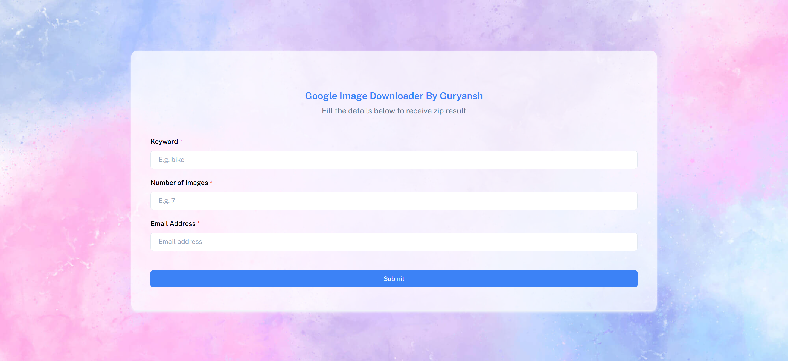

# Google Image Downloader

This project automates the process of downloading images from Google based on a keyword, zipping the images, and sending the zipped file via email.

---

## Authors

- [@Guryansh](https://www.github.com/Guryansh)
  
## Features

1. **Google Image Download**: Downloads images from Google using the `icrawler` package.
2. **Image Zipping**: Zips the downloaded images into a `.zip` file.
3. **Email Sending**: Sends the zipped file as an attachment to a specified email.

---

## Prerequisites

- Python 3.x
- Gmail account (for sending email)

### Required Python Libraries

```bash
pip install icrawler
```

## Live link
 [Webpage link](https://image-downloader-sand.vercel.app/)




[](https://choosealicense.com/licenses/mit/)